# Create Your First Website

## Overview

In order to create you website you need to write code using [HTML](../glossary.md).

This guide demonstrates the foundations of building a basic website. This includes headers, paragraphs, lists, links, and images.

## Creating The Project Folder

Before building your website, you may need a dedicated folder to store all your files. Doing so encourages cleanliness and easier management of your website.

1. **Open** *File Explorer* by **clicking** *File Explorer*.

    

    *Figure 1. The File Explorer icon on the Windows 11 taskbar.*

    ??? warning "I Do **Not** Have File Explorer Here!"
        File Explorer can be found by **clicking** the search function, and **entering** File Explorer.

2. **Click** your drive.

    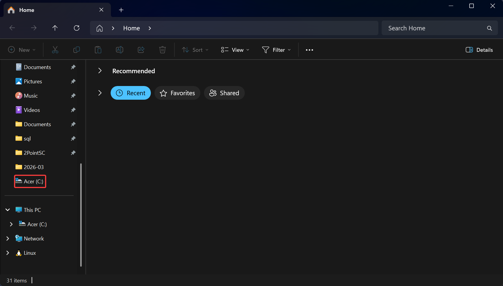

    *Figure 2. File Explorer Home screen with Acer (C:) drive selected in the left panel.*

    !!! tip "Why Use My Drive?"
        This is to simplify the searching process in order to find your website and avoid conflicts with OneDrive.

3. **Click** the *New* dropdown.

4. **Click** *Create*.

    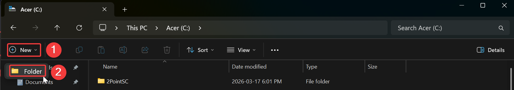

    *Figure 3. Clicking New then selecting Folder to create a new folder on the C: drive.*

5. **Enter** a name.   Ensure to *not* include *symbols* or *numbers* in your folder name.

    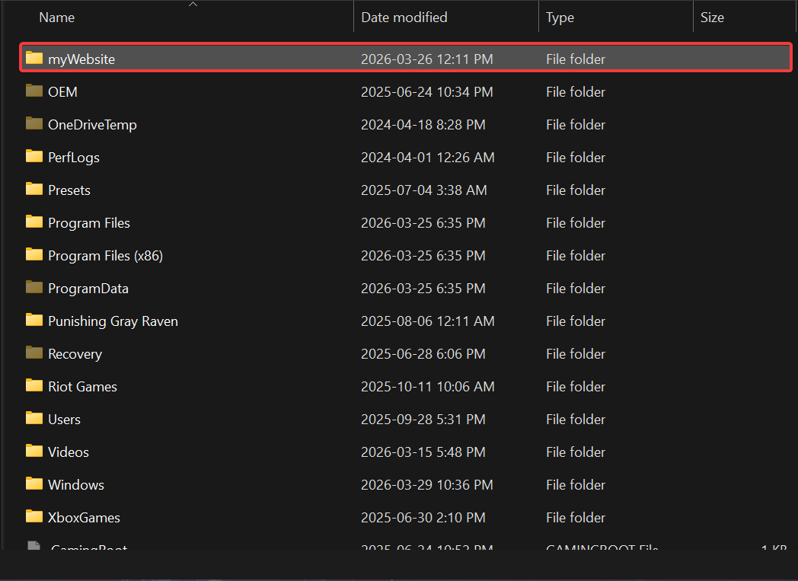

    *Figure 4. The newly created myWebsite folder appearing in the C: drive.*

    !!! success "Success!"
        Well Done! You have made a folder!

## Creating The Home Page

At this point, you should have an empty folder and *should* be aware of the location of it. 

1. **Click** the search function.

2. **Enter** *VS Code*.

    

    *Figure 5. The VS Code Welcome screen with Open Folder selected from the Start menu.*

3. **Click** *Open Folder*.

    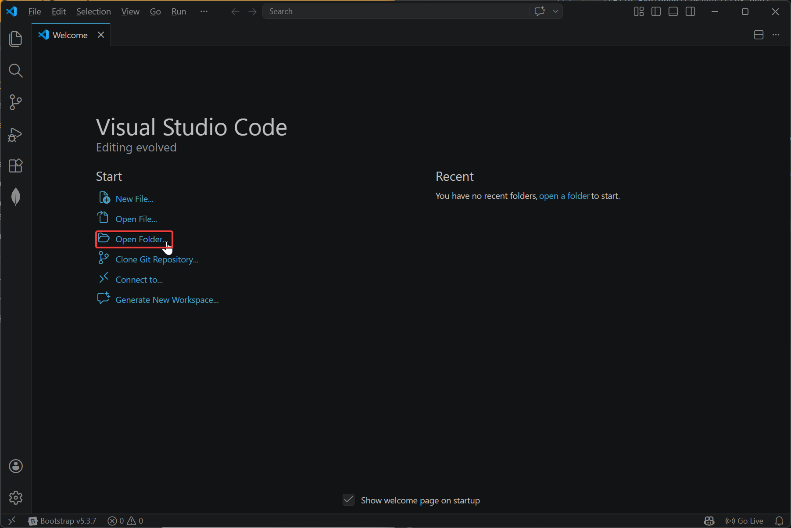

    *Figure 6. Navigating to and selecting the myWebsite folder in the VS Code Open Folder dialog.*

4. **Click** your drive.

5. **Click** your folder.

6. **Click** *Select Folder*.

    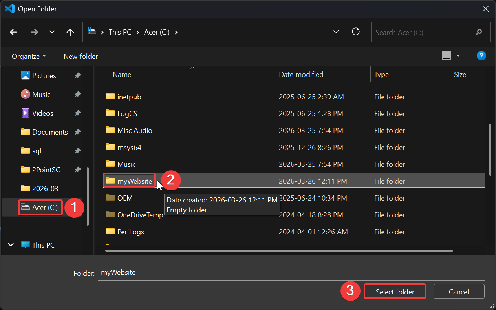

    *Figure 7. The myWebsite folder successfully opened in VS Code.*

7. **Click** the *New File* :material-file-plus: icon.

8. **Enter** `index.html`.

    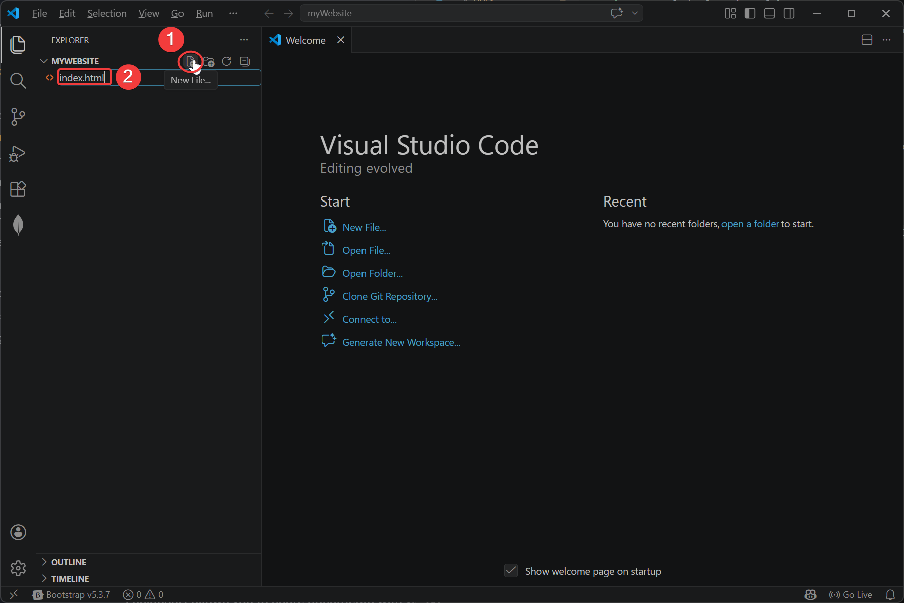

    *Figure 8. The empty index.html file open in VS Code, ready for content.*

9. **Press** *Enter*.

10. **Double-Click** `index.html`.

    !!! success "Success!"
        You have created a folder and have selected your HTML file in VS Code!

## Writing HTML Content

### Template

VS Code helps making a website. This is due to the simplicity and [extensions](../glossary.md#extention) it has.
For example, VS Code allows a simple template to start off with.

1. **Enter** `!`.

    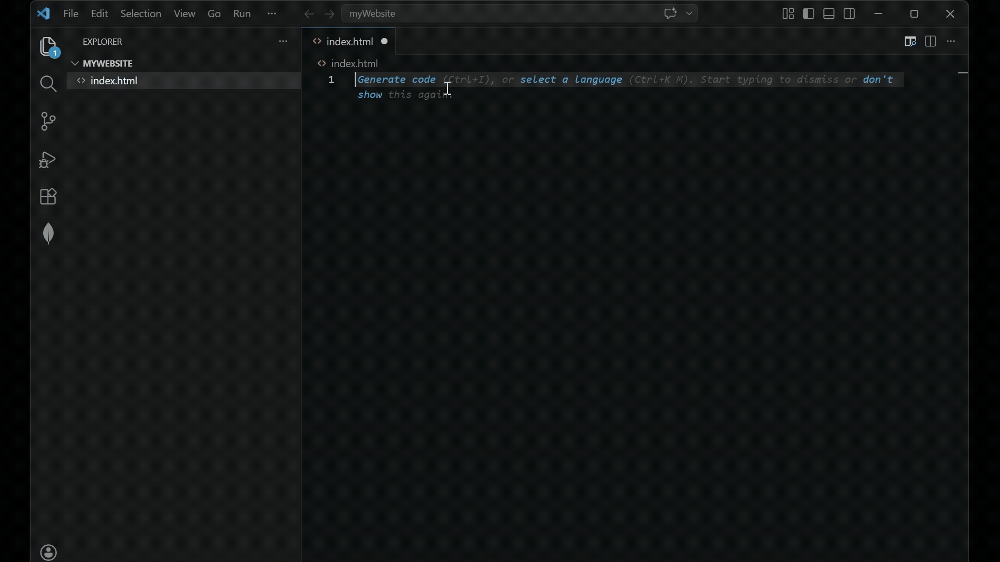

    *Figure 9. The Emmet template generated by typing ! in index.html.*

    ??? note "What Is The `!` ?"
        The `!` automatically generates a template thanks to [Emmet](../glossary.md#emmet), a *built-in* extension to VS Code.

    !!! success "Success!"
        You have created a template for your website.

### Headers

To implement headers in your website, you need to include the `<h1>` [tags](../glossary.md).

1. **Enter** `<h1>`.

2. **Type** your desired text.

    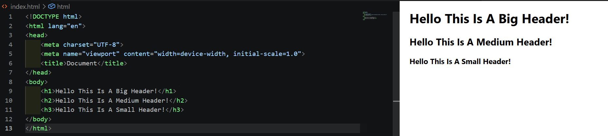

    *Figure 10. Header tags added inside the body with their rendered output.*

    ???+ info "What Does The Tag Mean?"
        Everything together in `<h1>` is called a tag.

    !!! success "Success!"
        You have created a header for your website.

### Paragraphs

To implement headers in your website, you need to include the `
` tags.

1. **Enter** `
`.

    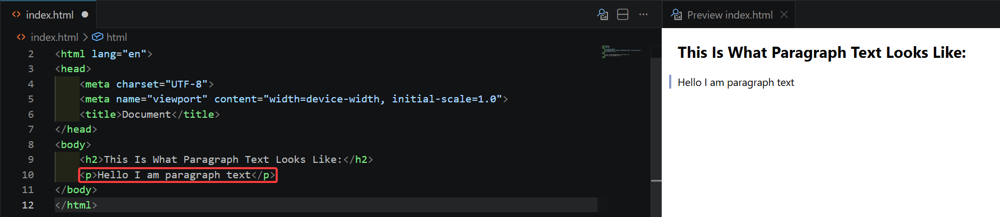

    *Figure 11. A paragraph tag added inside the body.*

    !!! success "Success!"
        You have created a paragraph for your website.

### Lists

To implement lists in your website, you need to include the `<ul>` tags.

1. **Enter** `<ul>`.

2. **Close** the [opening tag](../glossary.md).

3. **Press** *Enter*.

    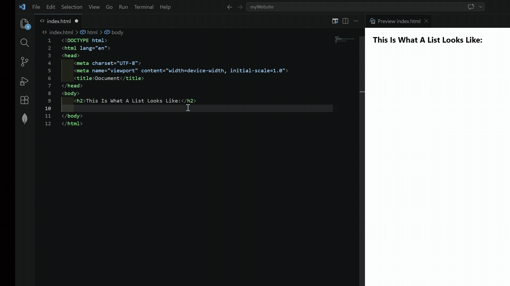

    *Figure 12. The ul tag ready for list items.*

    ??? info "What Is An Unordered List?"
        An unordered list is known as bullets.

4. **Enter** `<li>`.

    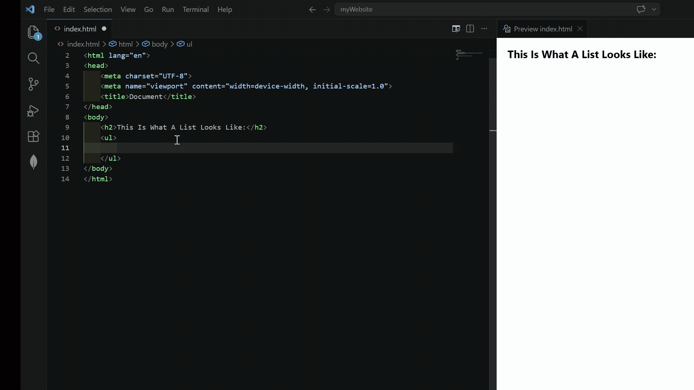

    *Figure 13. A list item added inside the ul tags.*

    !!! success "Success!"
        You have created a lists for your website.

### Images

To style implement lists in your website, you need to include the `` tags.

1. **Enter** ``.

    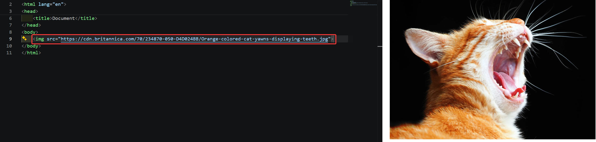

    *Figure 17. The finished image tag.*

    ??? warning "My Image Does Not Work!"
        If your image does not work seek the [troubleshooting-guide](../troubleshooting.md).

!!! success "Success"
    Your image should now appear in your browser.

## Conclusion

At this point, your website includes headers, paragraphs, lists, and images.

If your website does not include these features, please seek the [troubleshooting-guide](../troubleshooting.md). 