# Styling Your First Website

## Overview

CSS (Cascading Style Sheets) is used to style the appearance of your website. This guide demonstrates how to apply styling built on the website you created. This includes fonts, colors, spacing and positioning.

## Implementing a CSS File

Before styling your website you need a separate file to store your CSS. This ensures cleanliness and readability for your website.

1. **Click** the *New File* :material-file-plus: icon.

      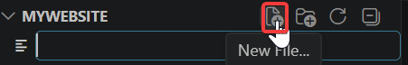

      *Figure 1. The New File icon in the VS Code Explorer panel.*

2. **Enter** `style.css`.

      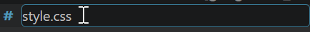

      *Figure 2. Entering style.css as the new file name.*

    ??? warning "Why Not Name It Something Else?"
        You can, but using `style.css` is standard practice and avoids confusion later.

## Linking CSS to HTML

Your CSS file will *not* work unless it is connected to your HTML file.

1. **Open** `index.html`.

      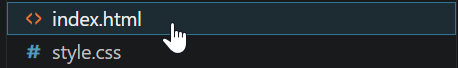

      *Figure 3. The index.html file selected in the VS Code Explorer panel.*

2. **Enter** `<link rel="stylesheet" href="style.css">`.

      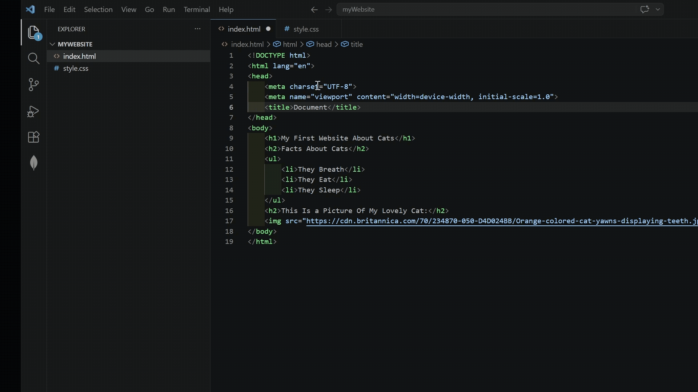

      *Figure 4. The link tag connecting style.css added inside the head of index.html.*

    ??? info "What Does The Tag Mean?"
        `rel="stylesheet"` tells the browser that the linked file is a CSS stylesheet.  
        `href="style.css"` specifies the location of the CSS file.

## Styling

### Styling Text (Headers or Paragraphs)

This section explains how to 

1. **Open** `style.css`.

      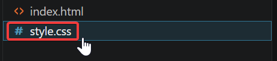

      *Figure 5. The style.css file selected in the VS Code Explorer panel.*

2. **Enter** `h1`.

3. **Enter** `{`.

      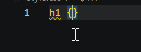

      *Figure 6. The h1 selector with an opening curly brace entered in style.css.*

    ???+ info "How Does This Work?"
        To clarify, `h1` is selecting *all* occurrences of `<h1>` in your website. The `{}` is what you are modifying to these occurrences.

4. **Press** *Enter*.

      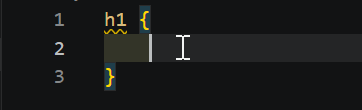

      *Figure 7. An empty line created between the opening and closing curly braces of the h1 rule.*

#### Styling Text Color

1. **Enter** `color: blue;`   (Do not forget to save your code using *Ctrl + S*! )

      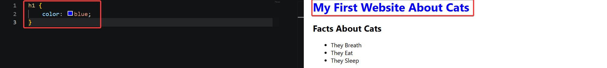

      *Figure 8. The color property set to blue inside the h1 rule, with the heading rendered in blue in Live Preview.*

    ??? info "How About Other Colors?"
        You can input red, yellow, or cyan in place of blue to name a few. To utilize other colors, you can use *RGB* values. For more information, visit [W3Schools](https://www.w3schools.com/colors/default.asp).

#### Styling Text Position

1. **Enter** `text-align: center;` below color.

      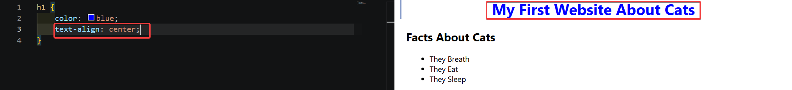

      *Figure 9. The text-align property set to center inside the h1 rule, with the heading centered in Live Preview.*

    ??? info "Are There Any Other Alignments?"
        You can input left, right, or justify. Left or right aligns text to their respective values while justify aligns each line so they have the same width.

#### Styling Font Size

1. **Enter** `font-size: 16px;` below text-align.

      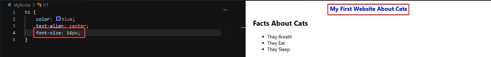

      *Figure 10. The font-size property set to 16px inside the h1 rule, with the heading rendered at the new size in Live Preview.*

    ??? info "What Is Font Size?"
        Font size is how big your text is. "px" are called pixels and are a unit of measurement for the size of the text.

### Styling Lists

1. **Enter** `ul`.

2. **Enter** `{`.

      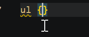

      *Figure 11. The ul selector with an opening curly brace entered below the h1 rule in style.css.*

3. **Press** *Enter*.

      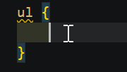

      *Figure 12. An empty line created between the opening and closing curly braces of the ul rule.*

#### Styling List Type

1. **Enter** `list-style-type: square;`.

    ??? info "Are There Other List Types?"
        Yes, there are circle (already by default), upper-roman, and lower-alpha.

      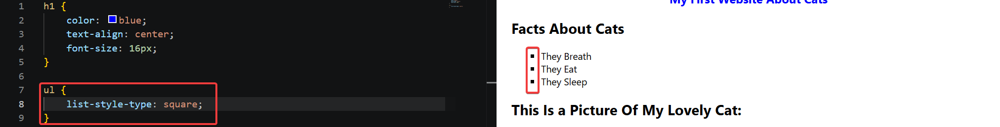

      *Figure 13. The list-style-type property set to square inside the ul rule, with the list rendered with square bullets in Live Preview.*

### Styling Images

1. **Enter** `img`.

2. **Enter** `{`.

      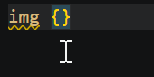

      *Figure 14. The img selector with an opening curly brace entered below the ul rule in style.css.*

3. **Press** *Enter*.

      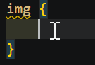

      *Figure 15. An empty line created between the opening and closing curly braces of the img rule.*

#### Styling Image Width

1. **Enter** `width: 300px;`.

      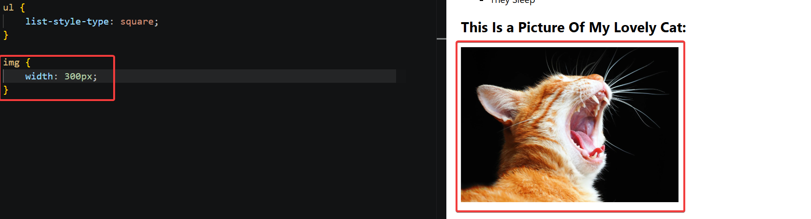

      *Figure 16. The width property set to 300px inside the img rule, with the image resized in Live Preview.*

    ???+ tip "How Can I Keep My Image Size Consistent?"
        The easiest way is to use "auto" in place of px. "auto" will maintain the proportions of the image automatically.

#### Styling Image Height

1. **Enter** `height: 800px;`.

      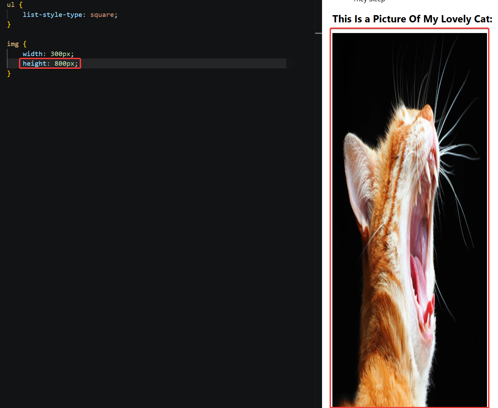

      *Figure 17. The height property set to 800px inside the img rule, with the image stretched vertically in Live Preview.*

## Conclusion

Your website has text color, position, size, a different list type, and image proportions customized. 

If your website does not include or had trouble incorporating these features, please seek the [troubleshooting-guide](../troubleshooting.md#images-not-showing).