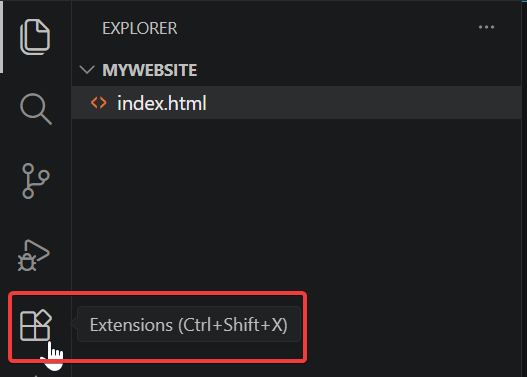
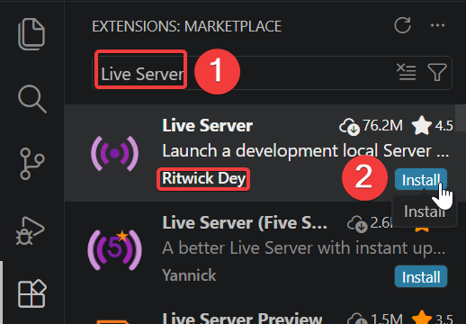
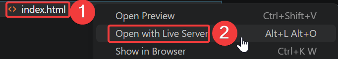
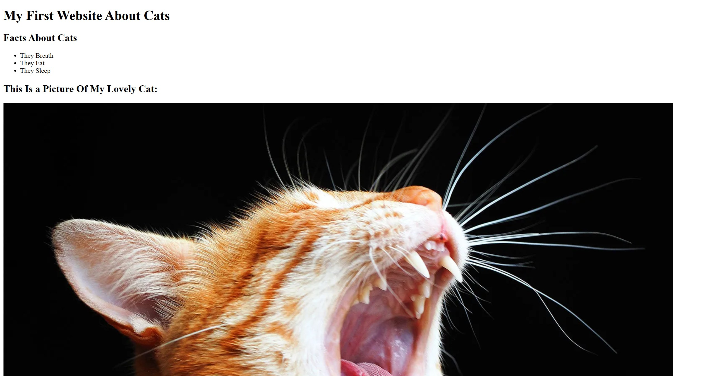

# Live Server

## Overview

Having to reload the page to see your work is tedious. Thankfully there is an extension to see your website update live. This guide demonstrates the installation process of [Live Server](../glossary.md#Live-Server) and how to see your website live.

## Installation

Assuming you are still in Vs Code, you will look through the extension marketplace to discover useful tools that will save you time, [debug] code faster, earn immediate feedback, allowing you to learn efficiently.

1. **Click** the [Extensions] :material-crop-square: icon.

      

2. **Enter** "Live Server".

3. **Click** install on the extension with the author: "Ritwick Dey".

      

    ??? tip "Are There Any Other Extensions Worth Getting?"
        I Recommend The Following:
         - "indent-rainbow" By "oderwat". For enhanced readability.
         - "Prettier - Code formatter" By "Prettier". For neat code.
         - "vscode-pdf" by "tomoki1207". For displaying PDFs in VS Code.

## Usage

Since you have installed "Live Server", you are now able to view your website live!

1. **Right-Click** on your "index.html" file. 

2. **Click** on "Open With Live Server".

      

    ??? warning "Where Is My File?"
        Ensure you are in your folder you have selected in [Creating The Home Page](../Basic-HTML/Basic-HTML.md#creating-the-home-page) and if you can not find it (or deleted it...), follow the steps in [Creating The Project Folder](../Basic-HTML/Basic-HTML.md#creating-the-project-folder).

## Conclusion

!!! success "Success!"
    Well Done! You can now view changes to your website live!
