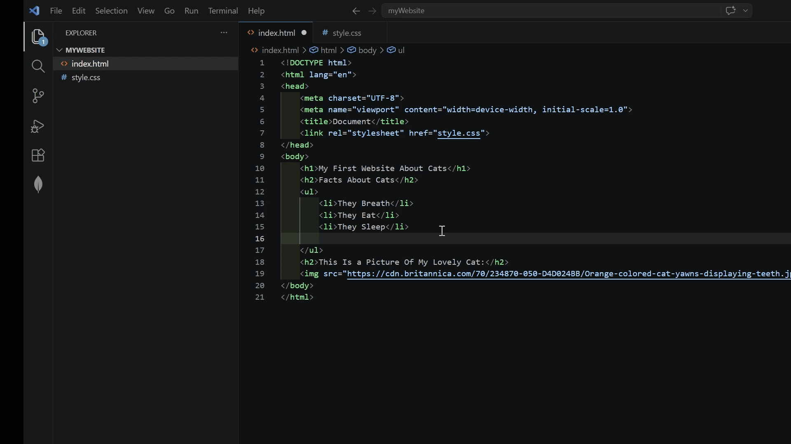

# View Your First Website

## Overview

Having to reload the page to see your work is tedious. Thankfully there is an extension to see your website update live. This guide demonstrates the installation process of [Live Server](../glossary.md#Live-Server) and how to see your website live.

## Install Live Server

Assuming you are still in VS Code, you will look through the extension marketplace to discover useful tools that will save you time, debug code faster, earn immediate feedback, allowing you to learn efficiently.

1. **Click** the *Extensions* :material-crop-square: icon.

      

      *Figure 1. The Extensions icon in the VS Code left sidebar.*

2. **Enter** `Live Server`.

3. **Click** *Install* on the extension with the author: "Ritwick Dey".

      

      *Figure 2. Searching for Live Server in the Extensions Marketplace and clicking Install on the extension by Ritwick Dey.*

    ??? tip "Are There Any Other Extensions Worth Getting?"
        I recommend the following:
         - "indent-rainbow" by "oderwat". For enhanced readability.
         - "Prettier - Code formatter" by "Prettier". For neat code.
         - "vscode-pdf" by "tomoki1207". For displaying PDFs in VS Code.

    !!! success "Success"
        You have installed Live Server! You should now be able to see Live Server in the "Installed" section in "Extensions".

## Open Live Server

Since you have installed Live Server, you are now able to view your website live!

1. **Right-Click** `index.html`.

2. **Click** *Open With Live Server*.

      

      *Figure 3. Right-clicking index.html and selecting Open with Live Server from the context menu.*

    ??? warning "Where Is My File?"
        Ensure you are in your folder you have selected in [Creating The Home Page](../Basic-HTML/Basic-HTML.md#creating-the-home-page) and if you cannot find it (or deleted it...), follow the steps in [Creating The Project Folder](../Basic-HTML/Basic-HTML.md#creating-the-project-folder).

    !!! success "Success"
        You have opened your website in Live Server! Live Server should have opened your web browser.

## View Live Server Changes

To confirm Live Server is working, make a small change to your webpage and save it.

1. **Click** inside your `index.html` file in VS Code.

2. **Edit** any text inside your `<h1>` tags.

3. **Press** `Ctrl + S`.

At this point, your browser should update to reflect this change.

*Figure 4. The index.html file open in VS Code, ready to edit and opened in browser to view live changes.*

!!! success "Success!"
    Well Done! You can now view changes to your website live!

## Conclusion

At this point, you have the ability to view changes to your website live.

If your website does not include these features, please seek the [troubleshooting-guide](../troubleshooting.md).