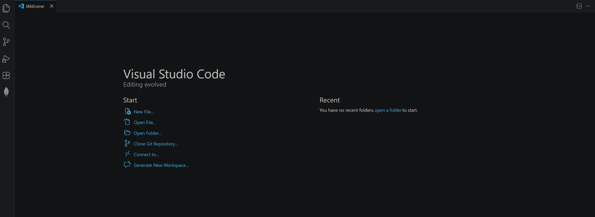

# Install Visual Studio Code

## Overview

Before you can write HTML, you need a place to write it. This task walks you through installing **Visual Studio Code (VS Code)** — a free code editor used to write HTML.  

## Download and Install VS Code

VS Code is the editor you will use to write all of your HTML code.

1. **Open** your web browser.

2. **Enter** [https://code.visualstudio.com](https://code.visualstudio.com) in the search bar.

    

    *Figure 1. Entering the VS Code website URL in the Chrome address bar.*

3. **Click** the *Download* button.

    

    *Figure 2. The VS Code homepage with the Download for Windows button highlighted.*

    !!! info "What Happens Next?"
        The website automatically detects your operating system and suggests the correct version.

    !!! success "Success!"
        You have downloaded VS Code!

4. **Open** *File Explorer*.

5. **Click** *Downloads*.

6. **Double-Click** the `.exe` installer file.

    

    *Figure 3. The VS Code installer file in the Downloads folder, ready to be opened.*

7. **Select** the license agreement.

8. **Click** *Next*.

    

    *Figure 4. Accepting the license agreement in the VS Code Setup window.*

9. **Click** *Next* on the *Select Destination Location* screen.

10. **Click** *Next* on the *Select Start Menu Folder* screen.

    !!! warning "Warning"
        Make sure *Add to PATH* is selected. If it is not selected, VS Code may not work correctly with some tools later.

11. **Click** the box labelled *Add to PATH*.

12. **Click** *Register Code as an editor for supported file types*.

    

    *Figure 5. Checking the Add to PATH and Register Code checkboxes on the Select Additional Tasks screen.*

13. **Click** *Next*.

14. **Click** *Install*.

    

    *Figure 6. The Ready to Install screen confirming the selected tasks, with the Install button highlighted.*

15. **Click** *Finish*.

    

    *Figure 7. The installation complete screen with the Finish button highlighted.*

    !!! success "Success"
        VS Code should now open automatically after installation.

## Conclusion

At this point, you have successfully installed Visual Studio Code.

If your website does not include these features, please seek the [troubleshooting-guide](../troubleshooting.md).