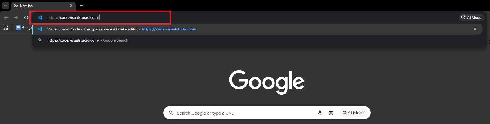
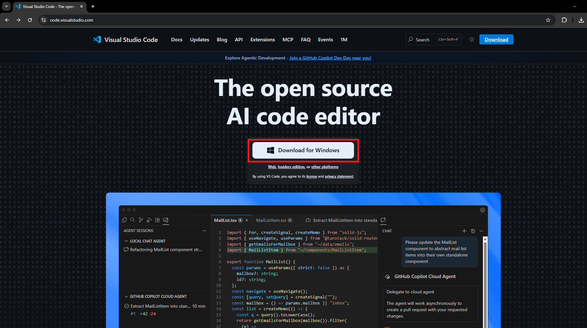
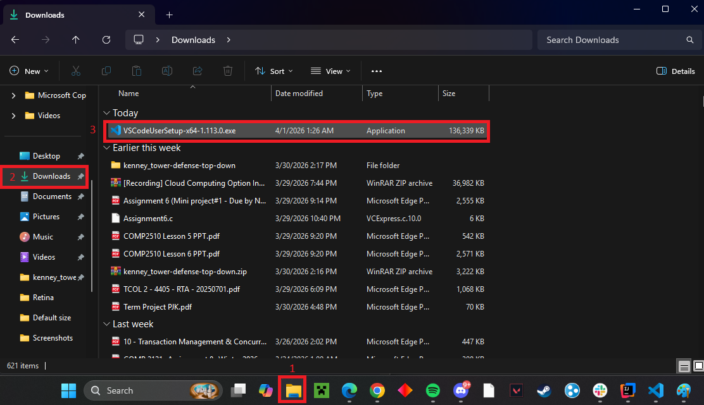
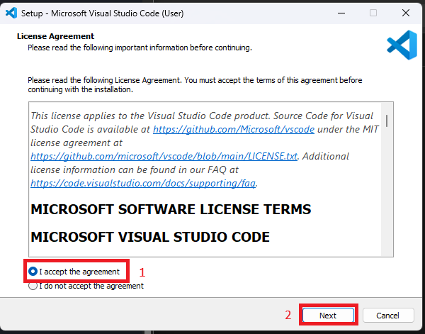
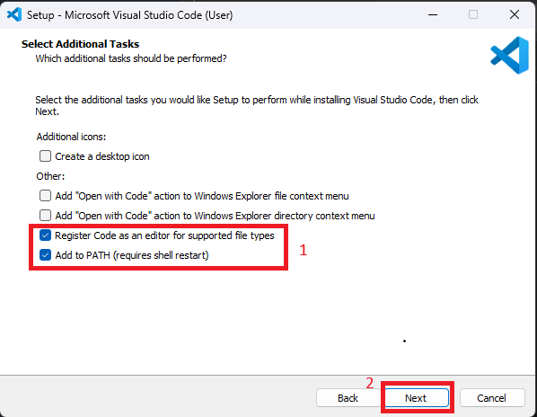
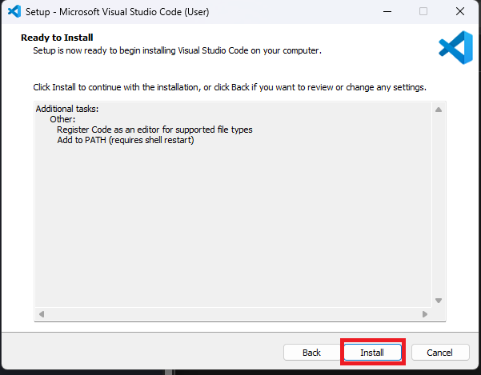

## Overview

Before you can write HTML, you need a place to write it. This task walks you through installing **Visual Studio Code (VS Code)** — a free code editor — and connecting it to **GitHub**, a platform that stores and backs up your code online.

---

## Download and Install VS Code

VS Code is the editor you will use to write all of your HTML code.

### Steps

1. Open your web browser and enter/click the following link: [https://code.visualstudio.com](https://code.visualstudio.com).
   

2. Click the large **Download** button. The website automatically detects your operating system and suggests the correct version, in our case it is Windows operating system.
   

3. Once the file downloads, open the `.exe` installer file from your Downloads folder.
   

4. Accept the licence agreement and click **Next**.
   

5. On the _Select Additional Tasks_ screen, check the box labelled **Add to PATH**.
   

6. Once both boxes has been selected, click **Next**, then **Install**.
   
7. Click **Finish** to launch VS Code.

---
